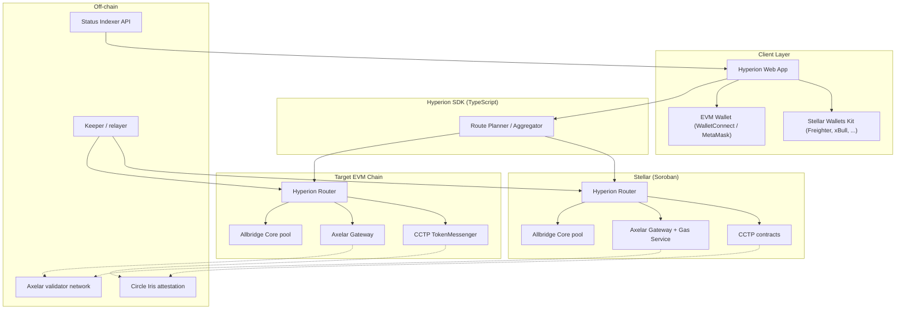

# Hyperion
### Stellar ⇄ EVM Cross-Chain Bridge — Architecture Plan

| | |
|---|---|
| **Version** | 0.1 — pre-implementation draft |
| **Date** | September 26, 2026 |
| **Status** | For review before Phase 0 kickoff |

---

## 1. Executive Summary

Hyperion is a non-custodial bridging and swap layer connecting Stellar to EVM-compatible networks. The core architectural bet — the one I'd make on any bridge started today — is this: **Hyperion does not invent its own cross-chain trust mechanism.** Nearly every large bridge exploit to date (Wormhole, Ronin, Nomad, Poly Network, Multichain) traces back to the same root cause: custom validator, signature, or message-verification logic that had a bug or got compromised. That problem is now solved well enough, by well-funded, independently audited teams, that re-solving it buys risk, not differentiation.

Instead, Hyperion is a **routing and aggregation layer** over interoperability rails that are already live, audited, and officially supported on Stellar as of 2026: Circle's CCTP, Axelar's GMP/ITS, LayerZero's V2 Soroban endpoint, and Allbridge Core, with NEAR Intents available as an optional swap-intent path. Hyperion's own code stays deliberately thin — a router contract per chain, an SDK that picks the right rail for a given asset and situation, and the off-chain plumbing to track transfer status. That's what keeps it auditable on a realistic timeline, and it's what makes it a credible Stellar Wave / GrantFox maintainer candidate rather than a research project that never ships.

## 2. Design Philosophy: Why a Router, Not a Bridge

- Bridge hacks account for a disproportionate share of all crypto losses to date, and almost all of them share one cause: a custom trust mechanism that failed. Building and securing that kind of system from scratch is a multi-year, multi-audit undertaking — a poor use of a first release, and a poor first ask of Stellar Wave/GrantFox reviewers.
- Stellar already has multiple independently built, independently audited interoperability rails live on mainnet: Circle's own CCTP implementation, Axelar's amplifier stack, LayerZero's V2 endpoint, and Allbridge Core's liquidity-pool bridge. Between them they cover official zero-slippage USDC transfer, general message passing, canonical token bridging, and pooled-liquidity swaps. There's no real gap that justifies a fifth trust mechanism.
- What's actually missing is a layer that (a) picks the right rail for a given asset/route without the user needing to know any of this exists, (b) gives Hyperion one place to enforce its own policy — fees, flow limits, pausing — independent of whatever's underneath, and (c) gives Hyperion something to actually own and open issues against, which matters since the goal is maintainer status, not a wrapper nobody touches again.
- It also shrinks the review surface: a steward can scope their attention to Hyperion's router and SDK and treat the underlying rails' security as already handled elsewhere. That's a far smaller, more fundable ask than "please review our new validator set."

## 3. Scope — v1

**In scope**
- **Assets:** USDC first (deepest liquidity, has an official audited rail — CCTP — on day one), then XLM and a short list of additional stablecoins.
- **Chains:** Ethereum mainnet (reach and liquidity), one low-fee L2 (Base or Arbitrum), and Circle's Arc — which launched mainnet on September 16, 2026 with USDC as native gas and is already CCTP/Gateway-connected. Since USDC is Hyperion's first asset, Arc is a low-effort, high-relevance third target; treat it as fresh (10 days old at time of writing) and re-verify tooling maturity before committing infrastructure to it.
- **Directions:** Stellar → EVM and EVM → Stellar, symmetric.
- **One "smart" path:** bridge-then-swap in a single user action via the destination rail's hooks, once the base routes are stable.

**Out of scope for v1**
- NFTs or other non-fungible transfers.
- A Hyperion-operated validator set, light client, or attestation service of any kind — this is the whole point of Section 2.
- Non-EVM destinations beyond Stellar and EVM chains, even though some underlying rails could reach further (Solana, Cosmos).
- A governance token or DAO. Treasury and fee parameters stay behind a plain multisig until there's real volume worth governing.

## 4. High-Level Architecture



The Route Planner is the only place that "knows" about all four rails. Everything below it — the router contracts, the rails themselves — is replaceable independently, which is what lets Hyperion add or retire a rail without touching the SDK's public interface.

## 5. Routing Decision Table

| Situation | Rail | Why |
|---|---|---|
| Native USDC, Stellar ⇄ any CCTP-connected chain | **Circle CCTP V2** (Stellar = domain 27) | Official Circle rail, zero-slippage burn-and-mint, no wrapped asset |
| XLM or another Stellar-native asset needs a canonical EVM representation | **Axelar Interchain Token Service** | Canonical registration, decentralized validator security, built-in flow limits |
| Arbitrary cross-chain instruction (e.g. "bridge and stake in one step") | **Axelar GMP** or **LayerZero OApp** | General message passing; pick per desired trust model — Axelar's PoS/amplifier validators vs. LayerZero's configurable DVN set |
| Non-USDC stablecoin, or any asset where waiting on attestation is worse than pool slippage | **Allbridge Core** | Liquidity-pool based, no attestation wait, Quarkslab-audited, mature |
| "I hold asset A anywhere, I want asset B on Stellar" | **NEAR Intents** | Solver network quotes/executes the swap directly into XLM or Stellar USDC |

## 6. Stellar-Side Contracts (Soroban)

```rust
use soroban_sdk::{contract, contractimpl, contracttype, Address, BytesN, Env, String};

#[contracttype]
#[derive(Clone)]
pub enum RouteKind { Cctp, AxelarGmp, AxelarIts, Allbridge }

#[contracttype]
pub enum HyperionError {
    RouteUnsupported = 1,
    FlowLimitExceeded = 2,
    Paused = 3,
    UnknownProof = 4,
    RecipientNotReady = 5, // e.g. missing trustline
}

#[contract]
pub struct HyperionRouter;

#[contractimpl]
impl HyperionRouter {
    /// Escrows or burns `amount` of `token` from `sender` and dispatches
    /// to the chosen rail's own Soroban entrypoint.
    pub fn bridge_out(
        env: Env,
        sender: Address,
        token: Address,
        amount: i128,
        destination_chain: String,
        destination_address: BytesN<32>,
        route: RouteKind,
    ) -> u64 { unimplemented!() } // returns a Hyperion-assigned nonce

    /// Called only by the selected rail's own verified receiver contract
    /// once it has independently confirmed the inbound message. Hyperion
    /// never re-verifies a cross-chain proof itself.
    pub fn bridge_in(
        env: Env,
        route: RouteKind,
        recipient: Address,
        token: Address,
        amount: i128,
        source_nonce: u64,
    ) { unimplemented!() }

    pub fn pause(env: Env, admin: Address) { unimplemented!() }
    pub fn set_flow_limit(env: Env, admin: Address, token: Address, limit: i128) { unimplemented!() }
}
```

## 7. EVM-Side Contracts

```solidity
// SPDX-License-Identifier: MIT
pragma solidity ^0.8.24;

interface IHyperionRouter {
    enum RouteKind { CCTP, AxelarGMP, AxelarITS, Allbridge }

    event BridgeOut(
        address indexed sender,
        address indexed token,
        uint256 amount,
        string destinationChain,
        bytes32 destinationAddress,
        RouteKind route,
        uint64 nonce
    );

    event BridgeIn(
        address indexed recipient,
        address indexed token,
        uint256 amount,
        RouteKind route,
        uint64 sourceNonce
    );

    function bridgeOut(
        address token,
        uint256 amount,
        string calldata destinationChain,
        bytes32 destinationAddress,
        RouteKind route
    ) external returns (uint64 nonce);

    /// Callable only by the corresponding rail's own verified receiver
    /// (CCTP's MessageTransmitter, Axelar's Gateway after validateMessage, etc.)
    function bridgeIn(
        RouteKind route,
        address recipient,
        address token,
        uint256 amount,
        uint64 sourceNonce
    ) external;

    function pause() external;
    function setFlowLimit(address token, uint256 limit) external;
}
```

Both sketches are interface-level on purpose — clean enough to hand to a codegen pass for the actual implementation and test suite once the rail choice per route is locked in.

## 8. SDK & Integration Matrix

**Cross-chain rails**

| Rail | Purpose | Key artifacts |
|---|---|---|
| Circle CCTP V2 | Native USDC burn-and-mint; Stellar is domain 27 | `circlefin/stellar-cctp` (Soroban), Circle's EVM TokenMessenger/MessageTransmitter, Bridge Kit SDK, Iris attestation API |
| Axelar GMP + ITS | General message passing + canonical token bridging | `axelar-amplifier-stellar` (Soroban Gateway + Gas Service), `@axelar-network/axelarjs-sdk` |
| LayerZero V2 | Configurable-security (DVN) messaging + omnichain tokens | Stellar/Soroban OApp & OFT endpoint (Code4rena-audited, April 2026), LayerZero EVM SDK |
| Allbridge Core | Pooled-liquidity native stablecoin swaps | Soroban `allbridge-core-soroban-contracts` (Quarkslab-audited), Allbridge Core JS/TS SDK & REST API |
| NEAR Intents | Solver-quoted swaps into XLM/Stellar USDC | 1Click API |

**Stellar & EVM tooling**

| Purpose | Library / tool |
|---|---|
| Stellar client, tx build/sign/submit | `@stellar/stellar-sdk` (Horizon + Soroban RPC) |
| Writing Soroban contracts | `soroban-sdk` (Rust) + `stellar` CLI |
| Stellar wallet connect | `@creit.tech/stellar-wallets-kit`, `@stellar/freighter-api` |
| EVM contracts & tests | Foundry, OpenZeppelin Contracts |
| EVM client & wallet connect | `viem`/`wagmi`, WalletConnect |
| Price data | Reflector (SEP-40, native Soroban oracle), DIA (cross-chain, also on Soroban) |
| Off-chain API & jobs | Fastify + TypeScript, Postgres, Redis/BullMQ |
| AI-assisted dev accuracy | `stellar/stellar-dev-skill` skill set + Stellar's MCP server |

## 9. Stellar ⇄ EVM Impedance Mismatches

This is the section to make everyone on the team read before writing a line of contract code. Every one of these has caused a real bug somewhere in the ecosystem.

1. **Address encoding — G vs. C vs. M.** Stellar has classic ed25519 accounts (`G...`), Soroban contract addresses (`C...`), and muxed accounts (`M...`, SEP-23 — many virtual sub-accounts sharing one underlying `G` account, common at exchanges). Cross-chain messages carry a raw 32-byte value with no type tag, so nothing on the EVM side can tell which kind of Stellar address it's looking at. CCTP's documented answer is a dedicated `CctpForwarder` contract that resolves and validates the destination before minting — Hyperion's router needs the same pattern on every route, not just CCTP. Get this wrong and funds mint to an address nothing can ever claim.
2. **Decimals: 6 vs. 7.** USDC uses 6 decimal places on EVM; Stellar's native unit is the stroop, 10⁻⁷ XLM, and most Stellar-issued assets follow 7 decimal places by convention. Forwarding a raw integer amount unconverted is off by exactly 10x. Every amount conversion needs an explicit, unit-tested helper — never inline arithmetic.
3. **Trustlines.** Any EVM address can receive any ERC-20 with zero setup. A Stellar classic account can't hold a non-native asset until it opens a trustline for that specific asset. A mint into an account without one just fails. The SDK should check trustline status before quoting an EVM→Stellar transfer, and the router should support sponsored reserves so a first-time recipient doesn't need XLM on hand just to open the trustline.
4. **Finality asymmetry.** Stellar ledgers close in roughly five seconds with deterministic finality — no reorgs once closed. EVM chains finalize probabilistically, or on their own sequencer-plus-L1 schedule for L2s. Any attestation-based route is gated by the slower side, which in practice is always the EVM leg. Build timeout, refund, and status-messaging logic around EVM finality, not Stellar's.
5. **Fee model.** Stellar fees are paid in XLM and are consistently tiny; EVM gas is volatile and paid in whatever the chain's native token is (except Arc, where it's USDC). Quote Hyperion's own protocol fee in the bridged asset itself so the number a user sees doesn't move with unrelated gas markets.
6. **State that expires.** Soroban contract storage has a TTL and archives if it isn't "bumped," unlike EVM storage, which persists until explicitly cleared. Long-lived router state — flow-limit counters, pending-nonce records — needs a keeper job extending TTLs, or it can silently disappear.

## 10. Security Model

- **Inherited, not invented.** `bridge_in` only ever acts on a call from the underlying rail's own verifier — CCTP's MessageTransmitter, Axelar's Gateway after `validate_message`, LayerZero's EndpointV2 after DVN quorum, Allbridge's Messenger contract. If the call didn't come from the rail's own contract, the router rejects it.
- **Only finalized source-chain state is ever truth.** No route accepts a client-supplied claim of "I sent X" — every mint or release is gated on the rail's own attested, finalized proof. This sounds obvious until someone proposes an "instant" mode that trusts an API response instead of a proof. Don't build that mode.
- **Minimal, pausable, timelocked admin surface.** `pause`, `setFlowLimit`, and any upgrade path sit behind a multisig with a timelock long enough to catch a compromised or careless signer before a change takes effect. `pause` stops new `bridge_out` calls; it must never block an already-attested `bridge_in` from completing — funds in flight should never get stuck because the switch was flipped.
- **Flow limits per asset, per route.** Axelar's ITS already ships flow limits — reuse rather than reimplement, and mirror the concept at the Hyperion router level so one misbehaving route or one depegging asset can't drain everything else.
- **Test the unhappy paths, not just the happy one.** Every route needs explicit tests for: a mint that reverts after a successful source-side burn/lock, replay of an already-processed message, a spoofed or malformed source address, and — for pool-based routes — a transfer exceeding available liquidity. A suite that only proves the sunny-day flow works doesn't tell a reviewer much.
- **Monitoring.** Every privileged call and completed transfer emits an event; the indexer should alert on anything privileged happening outside a known deploy or maintenance window.

## 11. Off-Chain Services

Two pieces, both optional to *security* — nothing off-chain is trusted to authorize a transfer — but necessary to *UX*:

- **Status indexer/API** — watches Horizon + Soroban RPC events on the Stellar side and EVM logs on the other, and exposes a single "where is my transfer" endpoint so the SDK isn't polling Circle's Iris, Axelar's explorer, an EVM RPC, and Horizon separately from the browser.
- **Keeper** — a scheduled job that extends Soroban storage TTLs before they archive (Section 9, point 6), and, for routes needing a permissionless "second step" (calling a rail's own relay/claim function once an attestation is ready), triggers that step so users don't have to come back and sign again. It should be writable so anyone could run it — no special privilege, just calling already-public functions — so it never becomes a centralization point.

Fastify + TypeScript for the API, Postgres for transfer records, Redis/BullMQ for the keeper's scheduled and retryable jobs — a plain, well-understood stack, nothing exotic needed here.

## 12. Repository & Dev Workflow

```
hyperion/
├── contracts/
│   ├── soroban/          # Rust, soroban-sdk — router + adapters
│   └── evm/              # Foundry project — router + adapters
├── sdk/                  # @hyperion/sdk — TypeScript, wraps both sides
├── app/                  # Next.js web app
├── indexer/              # Fastify status API + keeper jobs
└── docs/                 # this file, CONTRIBUTING.md, per-route runbooks
```

- **Stellar side:** `stellar` CLI + Scaffold Stellar for local dev, `soroban-sdk`'s `testutils` for contract unit tests, and the CLI's TS-binding generation so the SDK's Stellar calls stay type-safe against the actual deployed contract.
- **EVM side:** Foundry for contracts and tests — fast, with first-class fuzzing that's genuinely useful for the amount/decimal-conversion helpers in Section 9 — plus OpenZeppelin's audited `Pausable`/`AccessControl` rather than hand-rolled equivalents.
- **Frontend:** `@stellar/stellar-sdk` + `@creit.tech/stellar-wallets-kit` for the Stellar leg, `wagmi`/`viem` + WalletConnect for the EVM leg.
- **AI-assisted development:** Stellar publishes an official skill set for coding agents (`stellar/stellar-dev-skill` on GitHub — dapp/frontend, Soroban contracts, assets/trustlines, RPC data, and, as of this writing, a cross-chain skill in progress covering exactly the CCTP/Axelar gotchas in Section 9) plus an MCP server for live Stellar context. Wiring one of these into whatever generates contract, frontend, or test code here is worth doing before Phase 0 — the failure mode they exist to prevent (wrong address type, wrong decimal count) is precisely what Section 9 is about.

## 13. Fee Model & Sustainability

- **Protocol fee:** a flat basis-point fee (5–15 bps as a starting range) on `bridge_out`, denominated in the bridged asset, split between a treasury multisig and contributor rewards.
- **No fee on `bridge_in`** — never charge the receiving leg; it complicates accounting, and the recipient didn't choose the route.
- **Treasury feeds the maintainer flywheel directly:** fee revenue funds infrastructure costs (RPC, indexer hosting, monitoring), so Wave/GrantFox rewards stay focused on paying contributors for net-new work rather than subsidizing the lights staying on.
- Keep the fee parameter behind the same timelocked multisig as `pause`/`setFlowLimit` — a fee change is exactly the kind of parameter a steward reviewing the repo will check isn't a single-key operation.

## 14. Path to Stellar Wave / GrantFox Maintainer Status

Both programs route contributors to repos that already do something real — neither is a place to get Hyperion built from a standing start. Sequence matters:

1. **Ship the Phase 1 testnet MVP first** (Section 15) — one asset (USDC), one route (CCTP), both directions, with a test suite that includes the failure paths in Section 10, not just the happy path. A steward can usually tell within minutes whether "finalized" and "tested" are being used loosely.
2. **Document like external contributors already exist**, because the whole point is that they will: a real README, a CONTRIBUTING.md, and this architecture doc committed to the repo. GrantFox and Wave both sync directly against GitHub, so the repo itself is the pitch.
3. **Scope issues the way Drips' own maintainer guide recommends** — one clear outcome per issue, acceptance criteria stated up front, no hidden scope. A second EVM chain, the Axelar ITS route, the app's route-picker UI, and the indexer service are each naturally issue-sized once Phase 1 is done.
4. **Apply as a maintainer** — list the repo through Drips' maintainer flow ahead of the next Stellar Wave cycle, and through GrantFox's Maintainer App. Both are free to apply to; neither requires a prior Wave to be considered.
5. **Keep the issue queue fed.** Wave rewards a steady, well-curated flow of scoped work far more than a one-time dump of fifty issues — plan the next batch as soon as the current one clears.

## 15. Roadmap

| Phase | Goal | Key deliverables |
|---|---|---|
| 0 — Spec freeze (1–2 wks) | Lock this architecture, pick the Phase-1 rail and chain pair | Finalized interfaces (Sections 6–7), repo scaffolded, CI green on empty contracts |
| 1 — Testnet MVP (4–8 wks) | USDC, Stellar Testnet ⇄ an EVM testnet, via CCTP, both directions | Router contracts, SDK v0, minimal web app, indexer, full test suite incl. failure paths |
| 2 — Multi-route (parallel) | Add Axelar GMP/ITS + Allbridge as alternate routes; router picks the best one | Route-planner logic, second asset (XLM or a second stablecoin), issue backlog opened |
| 3 — Mainnet v1 | USDC only, conservative flow limits, independent review of router code | Mainnet deploy, monitoring/alerting live, Wave + GrantFox applications submitted |
| 4 — Scale | Add Arc / a second EVM chain, the NEAR Intents swap path, raise limits with real volume | Ongoing Wave issue cycles, protocol fee funding maintenance |

## 16. Risks & Open Questions

- **Third-party dependency risk.** Hyperion's security and uptime are bounded by Circle's, Axelar's, and LayerZero's own operations. Mitigated by keeping each rail behind a pluggable adapter so one can be disabled or swapped without redeploying the router.
- **Liquidity risk on pooled routes.** Allbridge-style routes can slip or cap out on large transfers; the router should quote against live pool depth and refuse or reroute rather than let a user eat unexpected slippage.
- **Issuer-level freeze risk.** USDC and most bridged stablecoins can be frozen at the issuer level regardless of what Hyperion's contracts do — worth stating plainly in the docs rather than implying the bridge is more censorship-resistant than its underlying assets are.
- **Router key management.** The router's own admin multisig (`pause`, flow limits, upgrades) is now the single most sensitive key in the system, precisely because everything else is outsourced to audited rails — don't under-invest here relative to the "we didn't build our own bridge" story.
- **Open decisions:** exact Phase-1 EVM testnet/chain pair (this plan assumes Sepolia for testnet, Ethereum + Arc for the first mainnet pair — confirm), the initial protocol fee, and whether to commission an external review of the router/SDK before or after the first Wave listing.

## Appendix A: Glossary for EVM-Native Contributors

| Term | Meaning |
|---|---|
| SCP | Stellar Consensus Protocol — Stellar's federated Byzantine agreement mechanism |
| Ledger | Stellar's equivalent of a block; closes roughly every 5 seconds |
| Horizon | Stellar's REST API for classic (non-Soroban) network data |
| Soroban | Stellar's Rust/WASM smart contract platform, live on mainnet since February 2024 |
| Trustline | An explicit opt-in an account makes before it can hold a given non-native asset |
| Anchor | A regulated fiat on/off-ramp entity (SEP-24/SEP-31) — distinct from a crypto-to-crypto bridge like Hyperion |
| SEP | Stellar Ecosystem Proposal — Stellar's standards track, analogous to an EIP |
| Muxed account | An `M...` address representing one of many virtual sub-accounts sharing a single `G...` account (SEP-23) |
| Stroop | The smallest unit of XLM, 10⁻⁷ XLM |
| Path payment | Stellar's native operation for sending one asset while the recipient receives another, routed through the built-in DEX |

## Appendix B: Reference Reading

- Stellar cross-chain transfers overview — developers.stellar.org
- Circle CCTP on Stellar — `github.com/circlefin/stellar-cctp`, developers.circle.com/cctp
- Axelar Stellar GMP guide — docs.axelar.dev/dev/general-message-passing/stellar-gmp
- LayerZero Stellar overview — docs.layerzero.network/v2/developers/stellar/overview
- Allbridge Core Soroban contracts — `allbridge-io/allbridge-core-soroban-contracts` on GitHub
- Stellar Wave — drips.network/wave/stellar
- GrantFox — search for their current app; it syncs directly against GitHub
- Official Stellar dev-agent skills — `github.com/stellar/stellar-dev-skill`
- For grant-application support specifically, Stellar Nigeria's Builder's Circle community runs sessions on exactly this

---

*This is a v0.1 planning document, not a security review. Treat every contract address, chain ID, and audit status above as something to re-verify against the linked sources at implementation time — this is a fast-moving part of the ecosystem, and Arc in particular is days old as of this writing.*